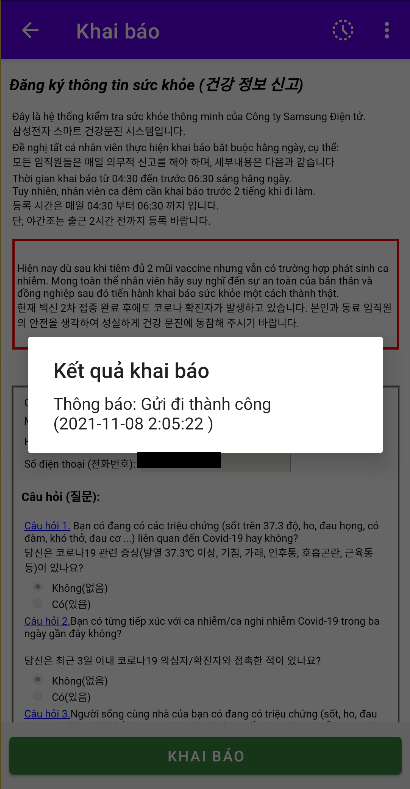
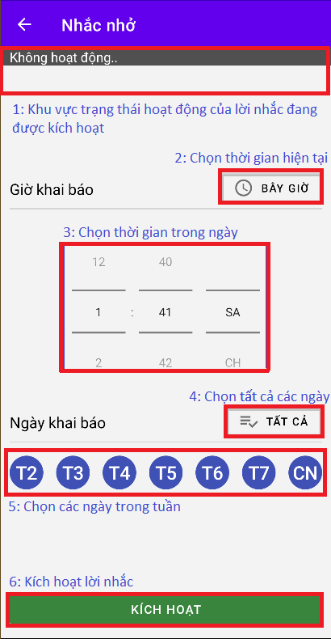
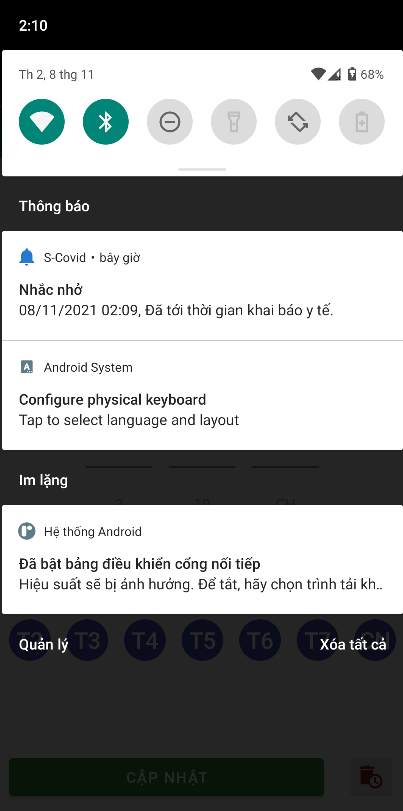
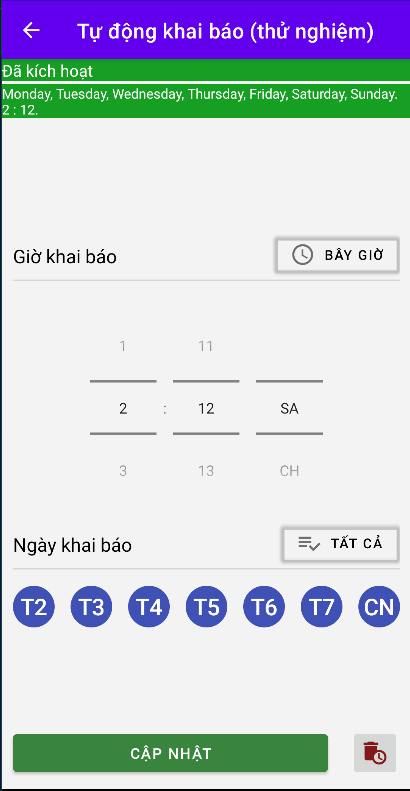
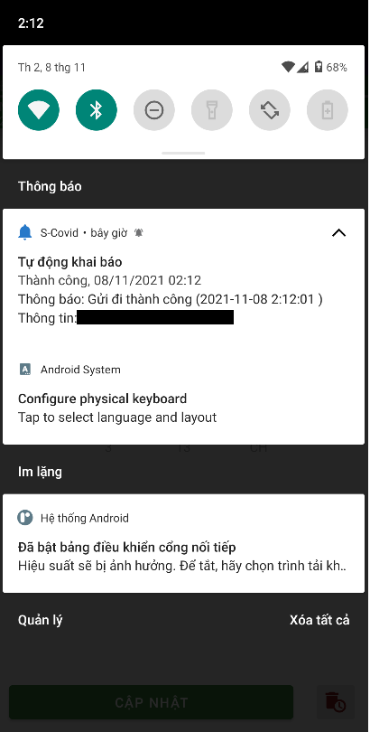
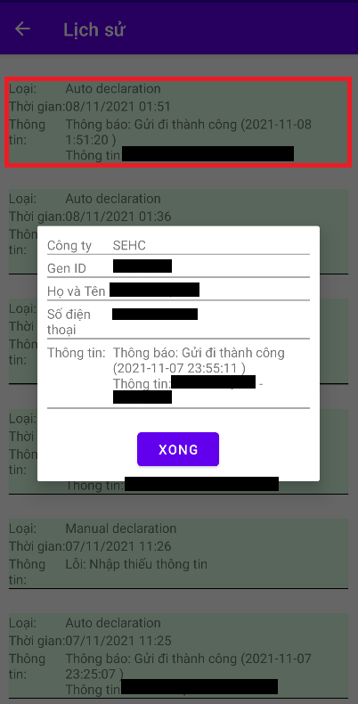

### Khai báo y tế.
#### Chức năng khai báo y tế tại SEHC.

- Ngay tại màn hình chính của ứng dụng, bạn có thể thấy ngay giao diện khai báo y tế quen thuộc.
- Tiến hành khai báo y tế với những thông tin đúng với tình trạng sức khoẻ của bạn.
    - Lưu ý: Phần thông tin số điện thoại, bạn nên để đầu số "84" thay cho "0".
- Sau lần khai báo đầu tiên, tất cả những thông tin cơ bản như Họ Tên, Số điện thoại, GenId sẽ tự động được điền sẵn cho lần khai báo tiếp theo.

  ||Khai báo thủ công|
  |----------------|----------------|
  |||

  

### Đặt lịch nhắc khai báo.
#### Chức năng tạo lịch nhắc khai báo hàng ngày.

```sh
- Lưu ý: Chức năng này cần quyền tự khởi động ứng dụng để có thể hoạt động chính xác.
- Nếu bạn không cho phép quyền này, lời nhắc sẽ xuất hiện trễ hoặc không xuất hiện. 
```

- Truy cập menu tuỳ chọn của ứng dụng. Sau đó lựa chọn: "Nhắc nhở"

  ||Menu tuỳ chọn|
  |----------------|----------------|
  |||

  
- Tại giao diện chính của chức năng. Tiến hành chọn thời gian cần nhắc trong ngày, các ngày trong tuần và nhấn Kích hoạt.

  ||Giao diện chức năng nhắc khai báo|
  |----------------|----------------|
  |||

  
- Kết quả

  ||Thông báo nhắc khai báo y tế|
  |----------------|----------------|
  |||

### Tự động khai báo.
#### Chức năng tự động khai báo hàng ngày dựa vào kết quả khai báo gần đây nhất

```sh
Lưu ý: 
- Đây là tính năng chỉ sử dụng cho mục đích nghiên cứu và không có giá trị thay thế cho việc khai báo truyền thống.
- Những vấn đề xảy ra trong/sau khi sử dụng tính năng này sẽ không liên quan tới bất kỳ cá nhân nào khác.
- Chức năng này cần quyền tự khởi động ứng dụng để có thể hoạt động chính xác
- Nếu bạn không cho phép quyền này, việc khai báo sẽ chậm trễ hoặc không thực hiện.
```

- Truy cập menu tuỳ chọn của ứng dụng. Sau đó lựa chọn: "Tự động khai báo".
- Giao diện và cách sử dụng chức năng này giống hoàn toàn với "nhắc nhở".
- Kết quả 

  |Màn hình tự khai báo đã kích hoạt|Kết quả khai báo|
  |----------------|-------------------------------|
  |||
 

  
### Lịch sử.
#### Chức năng giúp bạn xem lại lịch sử khai báo, lịch sử nhắc hẹn.

- Các hành động khai báo thủ công, tự động khai báo, thông báo nhắc nhở đều sẽ hiển thị ở màn hình này.
- Có thể chọn vào các lịch sử để hiển thị thông tin chi tiết.

  ||Màn hình lịch sử|
  |----------------|----------------|
  |||

